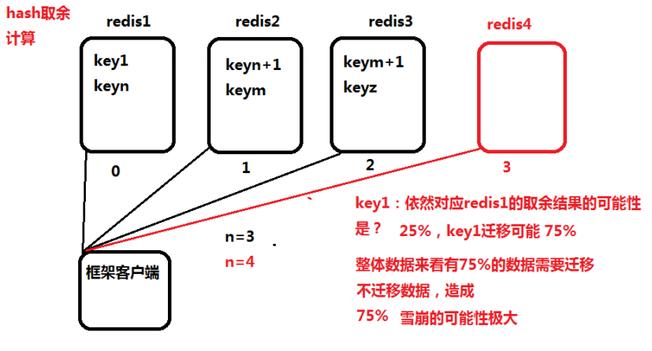
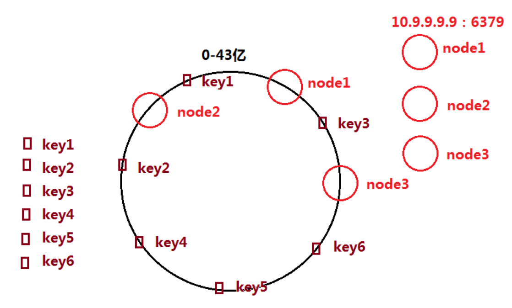
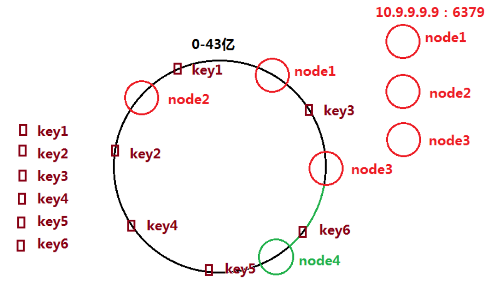
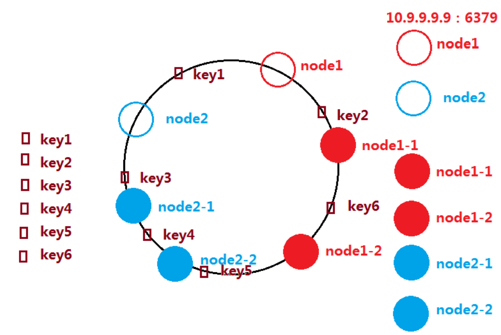
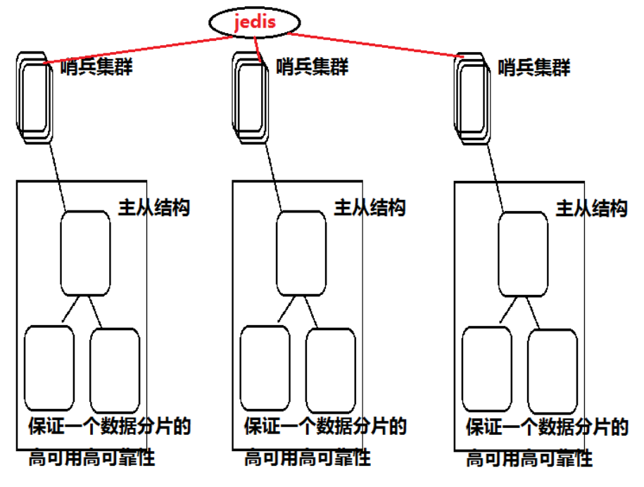
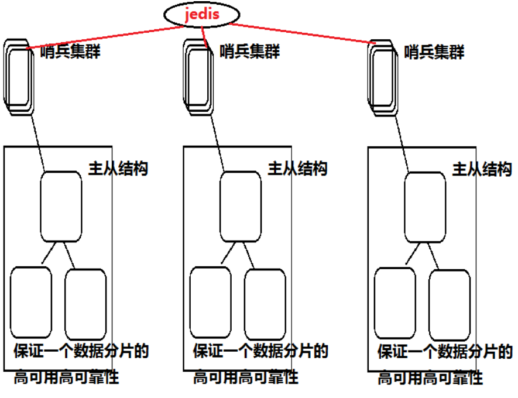
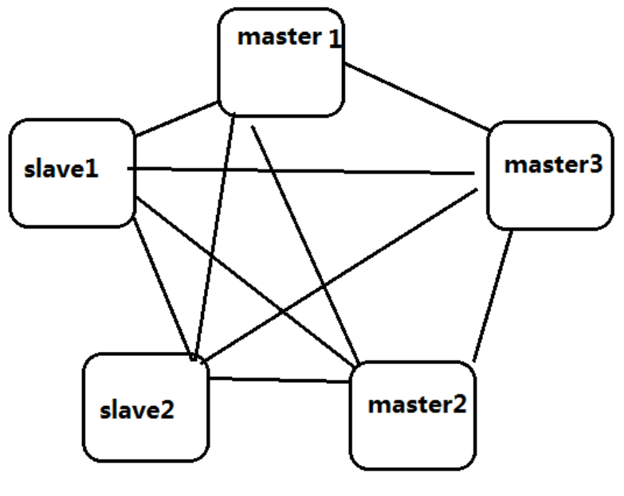
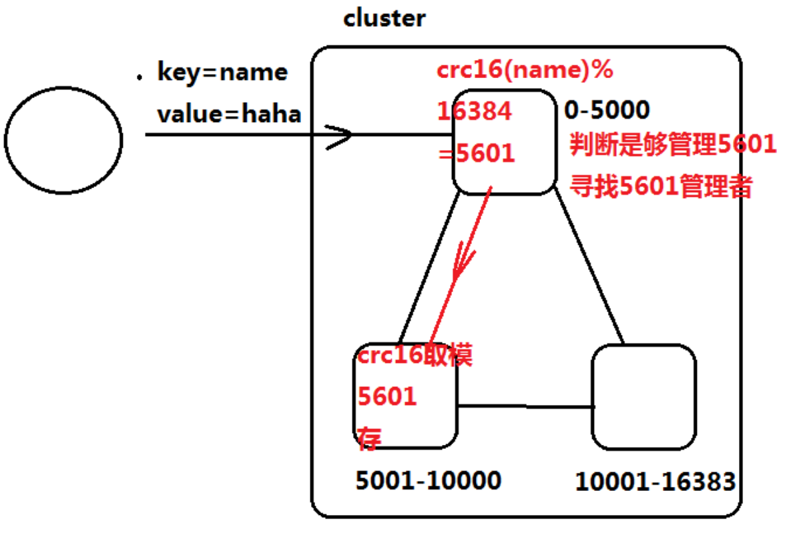
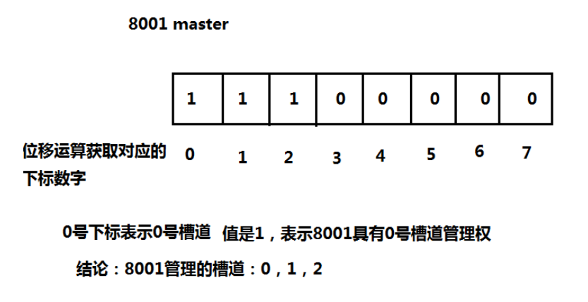
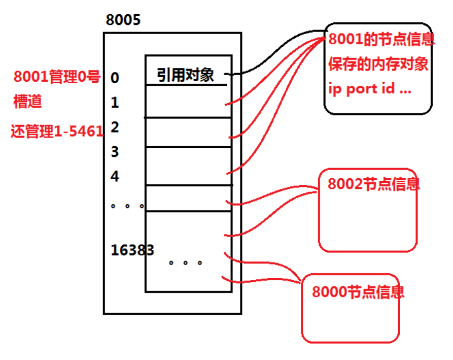

# Redis

> 缓存可以提升系统运行过程中数据获取的效率，是在工程内部使用的（java代码）。

企业中使用多种多样的第三方缓存技术，引入到工程中使用。

## Redis定义

> nosql，key-value，可持久化，分布式，内存，缓存，非关系型数据库

* 结构化数据：一类相同特点的数据集合
* 非结构化数据：海量数据，大数据
* 关系型数据库：结构化数据（表格/schema）
    * Oracle
    * mysql
    * mssqlserver
* 非关系型数据库：可以存储结构化数据，也可以存储非结构化数据
    * MongoDB
    * Redis

非关系型数据库存储非结构化数据的格式：key-value

**使用内存存储数据的缺点：** 

* 量少（分布式，海量集群解决）
* 容易丢失

**如果缓存中的数据由于内存断电丢失，会造成缓存的击穿——雪崩**

一旦出现雪崩，整个系统将会进入瘫痪状态。

Redis支持内存数据进行写入磁盘的操作（宕机数据恢复，容灾）。

## 雪崩/缓存击穿

> memoryCache：Redis之前占领市场的分布式缓存技术，性能非常高，但是不支持内存数据的持久化，易出现由于系统故障导致的缓存雪崩。

### 海量请求访问

如果数据的访问，由于缓存的未命中（缓存中没数据，内存数据丢失等原因），海量访问涌入数据库，数据瓶颈导致集群宕机。
重启数据库，缓存依然未命中，海量请求并未消失，造成数据库宕机、重启、系统不可用。

memoryCache与Redis对比：

* 性能相近
* Redis支持可持久化，memoryCache不支持
* 缓存的数据结构
    * memoryCache只支持String
    * Redis支持String、hash集合（list set zset）

## Redis缓存

> Redis最重要的功能，使用缓存的功能解决系统性能问题。

### 数据库缓存

利用key-value结构记录缓存内容，同一个sql语句是一个key值。
**下次执行相同的语句（查询）时，不会再封装`resultSet`**，减少了数据从磁盘的IO。

### 持久层缓存

减少了连接数据库的次数，并且减少`resultSet`封装成对象的过程。

### 控制层和业务层缓存

减少数据传递次数

* Redis作为缓存在SSM框架中的使用是在业务层中引入Redis代码实现数据的读写。

## Redis的安装和启动

1. 获取安装包
2. 解压

    ```bash
    tar -xf redis.tar.gz
    ```

3. 编译安装
    
    ```bash
    make && make install
    ```

4. 默认启动Redis

    ```bash
    redis-server
    ```
    
5. 后台启动Redis

    ```bash
    redis-server &
    ```

6. 检查后台运行的Redis服务

    ```bash
    ps -ef|grep redis
    ```
    
## Redis基础命令
 
Redis作为缓存可以在内存中存储五种数据类型：
 
* String：字符串类型
* hash：面向对象的存储方式
* list：链表
* set：集合
* zset：有序集合
 
### String
 
```bash
keys *
```

> 查看当前Redis中存在的所有key-value数据。

```bash
set key value
```

> 存放一个String类型的value数据，利用key值保存。

```bash
get key
```

> 获取String类型的数据。

```bash
select[]
#0-15
```

> 默认Redis将会进行分库操作，每个库和其他的数据库不连通。默认0号库。

```bash
exists key
```

> 判断key值是否存在。

* `get`能完成`exists`的功能，但`get`做了数据的读取操作
* Redis的value存储最大值为512M（version 3.2.11）

```bash
del key
```

> 删除key对应的value数据对。

```bash
type key
```

> 查看数据类型

```bash
save dump
```

> 将当期Redis的数据写出到默认Redis根目录的dump文件。

```bash
flushall
```

> 将内存和持久化文件的所有数据清空。

```bash
flushdb
```

> 清空当期库的内存数据。

```bash
incr decr key
```

> 自增自减，key对应的value是String，必须是数字。

```bash
incrby decrby key
```

> 对key的增加和减少设定步数。

```bash
append key value
```

> 数据追加。

```bash
expire key seconde
```

> 设定当前key的超时时间。

* Redis有自动删除数据的逻辑——最近最久未使用

```bash
ttl key
```

> 查看key的超时时间。

### Hash

```bash
hset key field value
```

> 设置一个hash结构的一条数据。

```bash
hget key field
```

> 获取一个hash结构数据的某个属性值。

```bash
hexists
```

> 判断hash结构的key是否存在。

```bash
hvals hkeys key
```

> 只获取属性值。

```bash
hincrby
```

> hash结构的计步器。

```bash
hlen key
```

> 获取hash数据结构的所有属性个数。

### 集合数据类型

> 在list中，左为上，右为下。从上到下相当于从左到右。

```bash
lpush key value
```

> 从左侧将value数据添加到一个名为key的list中。

```bash
lrange key [] []
# 起始位置 结束位置
```

> 展示链表的内容，从起止位置到结束位置。

```bash
rpush key value
```

> 从右侧插入链表数据，不是链表的结构有l必有r。

```bash
linsert []
```

> 插入数据。

* before：从左侧插入
* after：从右侧插入
* pivot：参数 原有的元素值
* value：准备新增的数据

```bash
lset
```

> 设置list中指定下标的元素值。

```bash
lrem
```

> 从list中删除count的相同值的元素。

* count > 0：表示删除的值从上往下删除
* count < 0：表示从下往上删除
* count = 0：全部删除

```bash
lpop
```

> 从list的头部删除元素，并且当前客户端获取删除的元素。

```bash
rpop
```

> 从尾部删除，返回元素数据。

```bash
rpoplpush
```

> 从第一个list的尾部移除元素，添加到第二个list的头部。

```bash
llen
```

> 返回list的元素个数。

## jedis

* 依赖jar包

    ```xml
    <dependencies>
        <dependency>
            <groupId>org.springframework.boot</groupId>
            <artifactId>spring-boot-starter-redis</artifactId>
            <version>1.4.5.RELEASE</version>
        </dependency>
    </dependencies>
    ```

1. jedis链接Redis

    ```java
    public class JedisTest {
        @Test
        public void test01() {
            //从代码链接任何技术，必须的参数
            //ip port，新建一个jedis对象，获取ip和端口信息
            //即可完成链接服务的操作
            Jedis jedis=new Jedis("106.75.120.140", 6380);
            //利用着一个链接对象，操作redis服务
            //jedis.set("name", "hanlaoshi");
            System.out.println(jedis.get("city"));
            jedis.close();
        }
    }
    ```

2. 模拟商品的缓存逻辑

    ```java
    public class JedisTest {
        @Test
        public void test02() {
            String id="123";
            String product="荣耀9i 4GB+64GB 魅海蓝 移动联通电信4G全面屏手机 双卡双待";
            System.out.println("用户开始访问商品，商品id"+id);
            //根据商品访问的业务逻辑，生成全局唯一的key对应商品的访问
            String key="ITEM_"+id;//item_123
            //链接redis
            Jedis jedis=new Jedis("106.75.120.140", 6380);
            //利用jedis客户端判断key是否存在
            if(jedis.exists(key)) {//表示存在缓存数据
                String info=jedis.get(key);
                System.out.println("数据从缓存获取，商品信息是："+info);
                jedis.close();
            }else {//缓存不存在数据，从数据库获取
                System.out.println("select * from product where id="+id);
                System.out.println("从数据库获取数据，并且存储到缓存，荣耀9i 4GB+64GB 魅海蓝 移动联通电信4G全面屏手机 双卡双待");
                jedis.set(key, product);
            }
        }
    }
    ```

3. 自定义数据存储的分片计算逻辑

    ```java
    public class JedisTest {
        @Test
        public void test03() {
            //准备jedis链接6379，6380，6381的客户端
            Jedis jedis1=new Jedis("106.75.120.140", 6379);
            Jedis jedis2=new Jedis("106.75.120.140", 6380);
            Jedis jedis3=new Jedis("106.75.120.140", 6381);
            //海量数据的存储需求
            for(int i=0;i<1000;i++) {
                //每次循环，相当于需要存储一个商品信息，生成对应的key-value
                String key="key_"+i;
                String value="value_"+i;
                
                if(i<33) {
                    jedis1.set(key, value);//33 以下的数据存储到6379
                }else if(i<66) {
                    jedis2.set(key, value);//6380
                }else {
                    jedis3.set(key, value);
                }
                
            }
            //海量数据的获取需求
            for(int i=0;i<100;i++) {
                String key="key_"+i;
                if(i<33) {
                    System.out.println(jedis1.get(key));//33 以下的数据存储到6379
                }else if(i<66) {
                    System.out.println(jedis2.get(key));
                }else {
                    System.out.println(jedis3.get(key));
                }
            }
        }
    }
    ```

    * 随着数据的不断增长和数据内容的不可控：
        * 数据倾斜严重（修改自定义的计算逻辑）
        * key值的取值范围发生变动

4. hash取余

    ```java
    public class JedisTest {
        @Test
        public void test04() {
            //准备jedis链接6379，6380，6381的客户端
            Jedis jedis1=new Jedis("106.75.120.140", 6379);
            Jedis jedis2=new Jedis("106.75.120.140", 6380);
            Jedis jedis3=new Jedis("106.75.120.140", 6381);
            for(int i=0;i<1000;i++) {
                String key="aklsdhflasjfls"+i;
                String value="value"+i;
                
                //获取取余结果
                int result=(key.hashCode()&Integer.MAX_VALUE)%3;
                if(result==0) {//存储到6379
                    jedis1.set(key, value);	
                }
                if(result==1) {//6380
                    jedis2.set(key, value);
                }
                if(result==2) {//6381
                    jedis3.set(key, value);
                }
            }
        }
    }
    ```

5. hash一致性

    ```java
    public class JedisTest {
        @Test
        public void test05() {
            //不能使用单独的链接对象jedis来操作集群，需要创建分片的对象
            //收集节点信息，告诉jedis集群的所有节点都是谁
            List<JedisShardInfo> infoList=new ArrayList<JedisShardInfo>();
            
            //封装3个节点的链接信息
            JedisShardInfo info1=new 
                    JedisShardInfo("106.75.120.140", 6379);
            JedisShardInfo info2=new 
                    JedisShardInfo("106.75.120.140", 6380);
            JedisShardInfo info3=new 
                    JedisShardInfo("106.75.120.140", 6381);
            infoList.add(info1);
            infoList.add(info2);
            infoList.add(info3);
            
            //利用收集到的信息，创建一个分片对象，分片对象的操作和jedis对象一值
            //但是在存储，读取数据时，已经对key值做了数据分片的计算，从而可以正确的到
            //某个节点获取，存储数据
            ShardedJedis sJedis=new ShardedJedis(infoList);
            //sJedis.set("name", "haha");
            
            for(int i=0;i<1000;i++) {
                String key=i+"";
                String value=i+"";
                sJedis.set(key, value);
            }
        }
    }
    ```
    
6. 分片的连接池

    ```java
    public class JedisTest {
        @Test
        public void test06() {
            //链接池中的每个链接对象，都需要链接3个节点的集群
            //收集节点信息，告诉jedis集群的所有节点都是谁
            List<JedisShardInfo> infoList=new ArrayList<JedisShardInfo>();
            
            //封装3个节点的链接信息
            JedisShardInfo info1=new 
                    JedisShardInfo("106.75.120.140", 6379);
            JedisShardInfo info2=new 
                    JedisShardInfo("106.75.120.140", 6380);
            JedisShardInfo info3=new 
                    JedisShardInfo("106.75.120.140", 6381);
            infoList.add(info1);
            infoList.add(info2);
            infoList.add(info3);
            //连接池，具有自己的一些配置信息，最大连接数，最大空闲链接
            //准备一个配置对象
            JedisPoolConfig config=new JedisPoolConfig();
            //设置一些参数
            config.setMaxIdle(8);
            config.setMaxTotal(200);//最大连接数
            //创建分片连接池对象
            ShardedJedisPool pool=new 
                    ShardedJedisPool(config, infoList);
            //获取链接对象
            ShardedJedis sJedis = pool.getResource();
            pool.returnResource(sJedis);
        }
    }
    ```
    
## 框架整合jedis

### 单节点引入框架代码

> 需求：通过框架，利用id查询user信息

1. 发起请求，传递id
2. controller调用service（缓存逻辑），调用mybatis持久层框架，执行sql

请求url：

```yaml
localhost: 8090/user?id=1/2
```

利用jedis的链接对象完成缓存逻辑：

* 性能上，非常差
* 代码内存占用大，高并发的访问，jedis创建的数量太多，没有对链接对象的管理
* 单个Redis节点存储数据小
* 应该表写`close`方法，防止内存溢出
    * 即使使用`close`方法，链接资源频繁的创建和销毁
    
**使用spring框架来管理一个连接池对象，在使用缓存的位置，注入使用。**

### 框架整合连接池

1. 配置链接信息
    
    ```yaml
    spring:
     redis:
      pool:
       maxIdle: 8
       maxTotal: 200
       minIdle: 1
       maxWait: 5000
    ```

2. 利用属性的注入`@Configuration @Value`初始化一个连接池对象

    编写一个配置类，利用`@Value`读取配置文件属性
    利用`@Bean`作用在一个初始化方法中，完成jedis分片连接池的创建工作

    ```java
    package com.jt.config;
    
    import java.util.ArrayList;
    import java.util.List;
    
    import org.springframework.beans.factory.annotation.Value;
    import org.springframework.context.annotation.Bean;
    import org.springframework.context.annotation.Configuration;
    
    import redis.clients.jedis.JedisPoolConfig;
    import redis.clients.jedis.JedisShardInfo;
    import redis.clients.jedis.ShardedJedisPool;
    
    @Configuration
    public class RedisConfig {
        
        //5个私有属性，利用属性注入，赋值
        @Value("${spring.redis.nodes}")
        private String nodes;
        @Value("${spring.redis.pool.maxIdle}")
        private Integer maxIdle;
        @Value("${spring.redis.pool.minIdle}")
        private Integer minIdle;
        @Value("${spring.redis.pool.maxTotal}")
        private Integer maxTotal;
        @Value("${spring.redis.pool.maxWait}")
        private Integer maxWait;
        
        //创建一个连接池对象，初始化的方法，返回连接池对象
        @Bean
        public ShardedJedisPool getPool(){
            //收集节点信息
            //{"10.9.9.9:6379","10.9.9.9:6380"}
            //收集的list对象
            List<JedisShardInfo> infoList = new ArrayList<>();
            String[] hostAndPorts = nodes.split(",");
            for (String node : hostAndPorts) {
                String host=node.split(":")[0];
                int port=Integer.parseInt(node.split(":")[1]);
                JedisShardInfo info=new JedisShardInfo(host, port);
                infoList.add(info);
            }
            
            // 创建config对象
            JedisPoolConfig config=new JedisPoolConfig();
            config.setMaxIdle(maxIdle);
            config.setMaxWaitMillis(maxWait);
            config.setMaxTotal(maxTotal);
            config.setMinIdle(minIdle);
            //  构造连接池对象
            return ShardedJedisPool(config, infoList);
        }
    }
    ```

## hash

### hash取余算法

> `hashCode()`  散列（随机和固定）

父类object的方法，目的是将任何类型的对象转化成int整数值。
**如果不是整数无法完成取余运算**。
hashCode结果可能是**负值**，散列计算后需要取正。

`Integer.MAX_VALUE`的二进制是31位个1。
与任何int整数做位的与运算，可以将其后31位保存。
原值为正，保持不变，原值是负，转化为正（不是绝对值）。

``` java
(key.hashCode() & Integer.MAX_VALUE) % N
```

### hash一致性

#### hash取余计算的缺点

1. 数据倾斜 **（散列必定倾斜）**
   分布式集群中，数据分片的太小（量）
2. 数据在服务器扩容时，会导致迁移量太大



* 当集群节点数量越多，扩容时，迁移的数据量越大
    * 所以jedis作为较新的客户端技术，并没有使用hash取余的分片计算
    
#### hash一致性

> 任何一个内存对象都可以通过一个散列算法映射到一个43亿的整数区间（0~43亿），这个区间称为一个**hash环**。

key值在hash环上，**顺时针寻找最近的节点映射整数，做对应关系的存储和读取**。



| node  | key        |
| ----- | ---------- |
| node1 | key1       |
| node2 | key2,4,5,6 |
| node3 | key3       |

hash一致性在扩容节点时的变化



key值依然顺时针取最近节点映射。
**扩容节点时，节点集群越多，迁移数据量越小**。
在足够多个集群中，扩容节点导致的数据迁移未命中甚至可以忽略。

#### hash一致性的数据平衡

> 由于真实节点数量不多，导致散列算法的计算结果，在数据分片保存时，出现巨大的数据倾斜。

因此引入*虚节点*：

> 虚节点只是获取更多的与node1相关的映射字符串ip+端口+序号，依然利用散列算法映射hash环。



| node    | key              |
| ------- | ---------------- |
| node1   | 10.9.9.9:6379    |
| node1-1 | 10.9.9.9:6379#01 |
| node1-2 | 10.9.9.9:6379#02 |
| node1-3 | 10.9.9.9:6379#03 |

key值根据顺时针最近节点整数进行映射，映射到虚拟节点的key，存储对应到当前虚拟节点的真实节点。
不管真实节点的数量有多少，只要虚拟节点的数量够多，数据平衡性就变有效了。
**真实节点对应的虚拟节点越多，数据平衡性越好**。

* jedis实现的hash一致性，虚拟节点数量，与当前真实节点的weight（权重）值
    * 虚拟节点的数量 = weight * 160
    * 默认情况，weight = 1
    
## Redis三节点分布式集群

**缺点：**

由于单个节点的故障宕机，整体的集群无法提供有效的缓存服务。
不支持高可用特点。

* 高可用：分布式集群中，一部分服务器（节点）宕机故障，依然可以提供整体的有效服务。
  结构基于**主从复制**完成。
  * 一旦主节点宕机，从节点必须携带已有的数据顶替主节点提供对方的访问。
* Redis可以支持一主多从节点的结构，并且支持多级的主从关系。
  * 主从结构越复杂，整体稳定性越不好。
  * 1主6从，最多二级主从
  
### 主从复制的搭建

1. 准备3个节点的主从Redis结构的配置文件
   修改模板，准备6382,6383,6384的Redis服务器配置文件
   利用vim替换  `:%s/6379/6382/g`
2. 启动3个节点

    ```bash
    redis-server 配置文件   #模式01
    ```

3. 检查各自的主从角色和主从状态

    ```bash
    info replication
    ```

4. 利用Redis的挂接主从的命令将3个节点变成1主2从的结构

    ```bash
    slaveof 主节点ip 主节点端口
    ```

5. 检查主从复制数据的情况


Redis主从结构为高可用的基础，只能实现数据的备份，不能完成替换的逻辑。

Redis主从结构当中，每个Redis只负责对数据的维护，整体结构的主从替换逻辑，需要另外的进程来完成——哨兵。

## Redis的哨兵高可用集群

> Redis高可用集群，需要启动哨兵进程，对主从结构监听，完成高可用替换等事件的决策。

### 哨兵运行原理

启动哨兵集群（单个哨兵判断结果未必正确），启动之后根据配置自动监听主从结构。
通过`info`命令查看当前的主从状态。
利用**rpc远程通信协议的心跳机制**，判断主节点是否宕机。
一旦宕机，发起事件的投票，哨兵集群的所有监听当前主从结构的进程一起完成，过半选举保证结果正确。
发起投票，在节点中选取一个主节点进行替换。



* Redis3.0之前常用的一种高可用分布式结构，`cluster`技术的出现，已经不再使用了。

### 哨兵的安装和测试

#### 安装哨兵集群

1. 修改启动哨兵的配置文件（sentinel.conf）

    ```bash
    # p15 bind 需要注释掉ip信息不要绑定
    # p17 protected-mode no 放开，配置no
    # 默认端口 26379 26380
    # p69 sentinel monitor mymaster 127.0.0.1 6379 2
    # sentinel monitor 开始监听主从结构中的主节点
    # mymaster 监听当前主从结构的代号
    ```
    
    * 主节点所在的ip（使用对外能往返的主节点ip）如果哨兵和主从节点在同一个机器，**不能使用`127.0.0.1`**
    
2. 主管下线票数（三个哨兵集群）
   哨兵集群某个节点也有宕机可能，一旦宕机会造成集群投票情况的变化。
   为了防止宕机过多最终导致整个哨兵的投票不可信（1个节点的投票不可信）
   选取新主节点失败时的时间延迟（第二轮选举和第一轮选举的时间间隔）
   
    ```bash
    # p131 sentinel failover-timeout mymaster 10000
    ```
    
    当前哨兵集群对某一个事件的选举如果不成立，将会根据这里配置的时间毫秒数进行第二次、第三次、第四次选举，直到最终结果出现。

3. 启动哨兵进程，开启监听主从结构

    ```bash
    redis-sentinel 启动文件
    ```
    
4. 测试
    * kill掉主节点，哨兵能否启动高可用
        * 发现宕机，`new-epoch 逻辑时间数 当前的日志步数`
    * 将宕机的主节点重启
        * 启动后发现哨兵将重启的主节点转换成从节点提供主从服务
    * 宕机掉一个哨兵
        * 当两个哨兵管理主从时，一个宕机，导致另一个的选举没有过半无法生效
    * 最好启动奇数个哨兵，使得每次至少有过半的哨兵选举成功
5. 重启哨兵集群
   先启动3个主从节点
   
   ```bash
    redis-server master.conf   # 6382
    redis-server slave01.conf  # 6383
    redis-server slave02.conf  # 6384
    ```
    
    检查主从关系，分别登录每一个节点调用`info replication`查看
    将没有挂接的重新挂接主从（使用内网地址挂接）
    查看sentinel配置文件
    如果和当前重新建立的主从结构一致，直接启动哨兵
    如果端口和启动的主从不一致，修改端口，删除最后的配置内容，日志的记录
    然后保存启动哨兵
    如果哨兵配置文件和主从结构一致，不需要修改直接启动
    
#### 缺点

1. 客户端jedis实现代码端的高可用很复杂

   
   
   通过各种异常逻辑，完成对哨兵的链接，获取准确的主节点创建连接池
   
   * 逻辑：通过代码确定3个主节点的连接池，提供正常服务，一旦某个主节点宕机，连接池不能继续使用，通过`catch`语句从哨兵集群中获取最新的主节点信息，重做连接池。
   * 技术端高可用实现后，代码实现高可用很复杂
   
2. hash一致性计算数据分片

   * key值的存储相对被动，数据微调时无法实现
   * key-node对应关系，由于hash一致性存在强耦合
   
3. 节点使用效率
   非常低，在没有高可用替换的场景，没有作用。
   
### Redis-cluster



#### 集群特点

1. Redis的集群所有的节点彼此两两互联（包括主节点和所有的从节点），通过内部二进制传输协议完成通信，保证通信速度。
2. 节点的事件，不是哨兵完成，是通过过半选举的主节点完成，（哨兵依然存在，整合到主节点）。一旦发现需要投票的事件，主节点全部参加。一个集群的最小主节点数量为3个。
3. 客户端无需关心分布式的数据分片逻辑，只要链接至少其中一个节点，就可以将数据正确的进行内部分布式转发。
4. 集群包所有的主节点映射（管理）到一个0~16383的整数区间，整数表示16384个槽道（slot）。
   * key值交给任何一个节点进行读写操作时，都会先计算当前key对应的槽道号（CRC16散列计算）hash取模运算
   * 只有负责管理槽道的主节点，才能存储key。
5. 槽道的工作逻辑

   
   
   * 节点如何通过槽道的逻辑判断管理权（每个节点如何知道管理槽道的范围号）
   * 判断管理权后，如何获取正确的槽道管理者
   
## 槽道

每个Redis的主节点当中，保存一个当前集群唯一的二进制数据
从前到后，分别分配一个下标号（利用二进制的位移计算）
下标号0-16383，每一个下标表示对应一个槽道，如果当前节点管理某个下标对应的槽道，二进制的值是1，不管理是0



* 位序列的特点在集群
    1. 主节点的二进制不仅相互不相同，每一位二进制的值，只有一个节点是1
    2. 从节点二进制值全是0

### 集群的槽道管理者信息

集群所有节点都具有相同的一个16384个元素的数组
每个元素的下标对应一个槽道号
当前下标元素的值，就是管理槽道号的节点信息引用对象



在一个网络连通顺畅的集群中，所有节点的数组数据全都一致
如果有删除槽道的操作，进行同步
元素内容不仅代表槽道号，指向一个节点信息，还指向其他内容（槽道状态，槽道对应的key值等）

## Redis集群命令

```bash
cluster info
```

> 打印集群的信息

```bash
cluster nodes
```

> 列出集群当前已知的所有节点，以及这些节点的相关信息

```bash
cluster meet [ip] [port]
```

> 将ip和port所指定的节点添加到集群当中

```bash
cluster forget [node_id]
```

> 从集群中移除node_id指定的节点（保证空槽道）

```bash
cluster replicate [node_id]
```

> 将当前节点设置为node_id指定的节点的从节点

```bash
cluster saveconfig
```

> 将节点的配置文件保存到硬盘

```bash
cluster addslots [slot] [slot...]
```

> 将一根或多个槽指派给当前节点

```bash
cluster delslots [slot] [slot...]
```

> 移除一根或多个槽对当前节点的指派

```bash
cluster flushslots
```

> 移除指派给当前节点的所有槽，让当前节点变成一个没有指派任何槽的节点

```bash
cluster setslot [slot] node [node_id]
```

> 将槽slot指派给node_id指定的节点，如果槽已经指派给另一个节点，那么先删除另一个节点的该槽，然后指派

```bash
cluster setslot [slot] migrating [node_id]
```

> 将本节点的槽slot迁移到node_id指定的节点中

```bash
cluster setslot [slot] improting [node_id]
```

> 从node_id指定的节点中导入槽slot到本节点

```bash
cluster setslot [slot] stable
```

> 取消对槽slot的导入或者迁移

```bash
cluster keyslot [key]
```

> 计算键key应该被放置在哪个槽上

```bash
cluster countkeysinslot [slot]
```

> 返回槽slot目前包含的键值对数量

```bash
cluster getkeysinslot [slot] [count]
```

> 返回count个slot槽中的键
