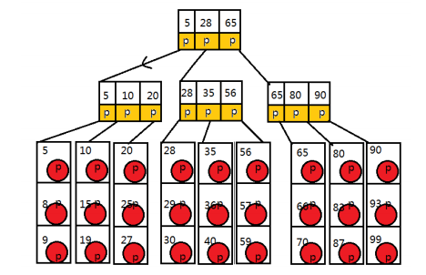
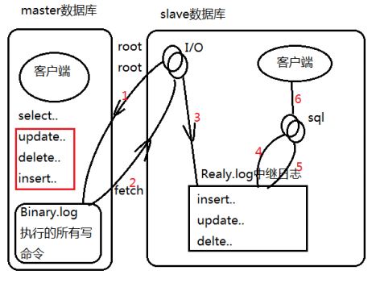
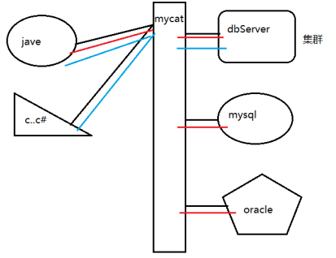
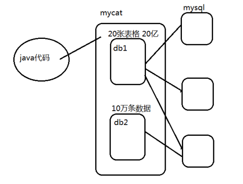
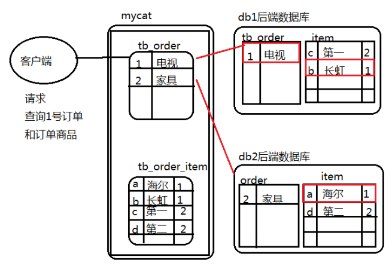

# maycat

## 单机数据库策略

### 数据库的设计

#### 范式的设计思路

##### 三范式的数据库结构

早期的硬盘存储空间非常昂贵，想方设法节省空间，时间效率并不重要。
利用三范式设计数据库结构表格，可以做到**最大限度的利用时间换取空间。**

##### 反范式的数据库结构

违反三范式的原则，完成**空间换取时间的最大限度的设计。**

### 索引优化

> 索引是按照一定的数据结构设计，实现的存储在磁盘上的一批数据文件，这些文件可以实现操作数据库的快速的效果（查询）

通过数据库的各种索引结构的变动，修改，可以提升单个数据库的CRUD的各种操作的效率。

#### 查字典（拼音检索）

对于查询某个汉字（像），数据库搜索一条数据：

1. 找到拼音法所在的页面——第一次IO
2. 找X——第二次IO
3. 找xiang——第三次IO
4. 找像——第四次IO

最终的效果：减少磁盘IO的情况下，获取需要的数据。

### mysql的索引结构

> b+tree

上图描述的是一个三阶的b+tree
每个方块表示磁盘的一块存储空间
每个数值表示当前索引中使用的数据内容

例如：寻找一个id值为30的数据记录

从根节点开始
第一次io读取节点的5,28,65，判断30与其的关系，获取中间的指针
第二次io读取二级节点的28,35,56，判断30与其的关系
第三次io读取28,29,30,红色指针称为卫星指针，指向数据记录的真实位置
第四次io获取id为30的所有数据记录

随着数据量的不断增加，技术积累的条数扩大，b+tree的样子，树的结构会变得越来越高，越来越宽，最大查询io次数，阶数+1

### mysql的主从复制

支持一主多从，多级主从的结构，最多搭建1级主从，实现读写分离，双机热备（分布式数据库结构中的数据分片高可靠高可用最小单位）。

#### mysql主从复制的原理

* master中：开启一个二进制日志文件，只要开启这个二进制，随着任何主节点的客户端的sql命令操作完成，就会将写命令记录在二进制文件中。
* slave：开启中继日志，io线程，sql线程。
    * io线程：登录主节点，监听二进制文件，一旦发现更新，将更新的命令抓取到从节点，写入中继日志。
        * 更新的判断是通过position的值完成，每次写操作主节点中的position值就发生了变动。
        * 中继日志：记录io读取过来的所有主节点写命令，也有更新的position值。
        * sql线程：监听中继日志，通过position判断更新，一旦更新，启动一个客户端，执行所有的更新命令。
        
## mycat中间件

数据分布式集群，需要中间件进行管理

数据库中间件：

1. amoeba：可以实现读写分离，高可用替换（更新停止）
2. cobar：mycat前身
3. mycat

> mycat是一个彻底的开源的面向企业的应用开发的大型数据集群中间件。

特点：

1. 高性能的支持读写分离的中间件
2. 100亿级别的大表水平分片，并行计算
3. 整合多种资源
    * 多源输入，单源输出
    * 单源的输入，多源输出
    * 多源输入，多源输出

### 核心概念

逻辑库：底层控制若干数据库的集群节点，数据库中的数据通过mycat观察或者使用时非常庞大的，实际来源并不是自身内容，是管理的数据库集群提供的。

逻辑库（逻辑库中数据的细化体现）

* 分片表：当整体数据极其庞大时，需要在逻辑中的某几个表格实现分片表的逻辑，表格中的庞大数据实际来源是从不同的真实数据库来的，mycat必须对分片表的来源做具体的配置。
* 应用场景：当整体数量特别大的时候，超出任何单个数据库表格的上限，需要被mycat进行数据分片切分的管理，在mycat中使用的表格是分片表。
* 非分片表：相对应分片表而言，当企业中使用的某个表格的数据不是特别庞大的时候，mycat中需要使用非分片表，所有的表格来自于一个数据库。
* er表：分片表的一种特殊情况，当表格的数据有关联的时候，分片表的单独设计，非常容易引起底层mycat跨库操作，这种情况影响分布式计算的效率，需要设计一种表格的结构避免这种情况——er分片表。
    
    * 分片表格逻辑表：在切分时，不会考虑关联关系，所以会造成海量数据关联查询时，底层的跨库操作，请求海量并发，会影响整体集群的效率。
