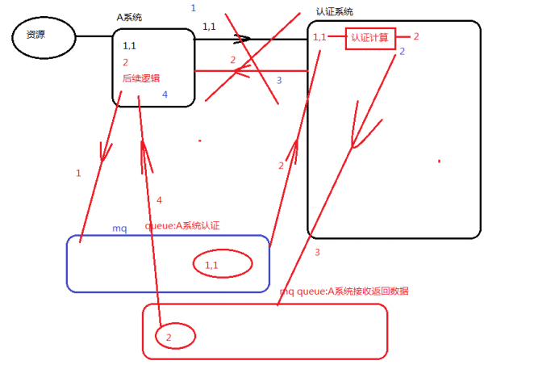
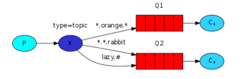

# rabbitmq

## 通信解耦


通信认证过程中，一旦通信步骤1,3出现问题，整个认证需要重新开始，出现通信过程强耦合。
需要通过消息队列对2个系统间的通信进行解耦操作。



## 消峰限流


并发非常高的情况下，直接通信的过程会导致由于并发能力的限制，很多请求无法直接响应，需要利用消息队列完成消峰限流。

## 消息队列的安装

### erlang

* 并发能力非常高
* 性能高
* 可以控制CPU资源（核，线程）

rabbitmq中存在各种不同语言环境的客户端，需要一个稳定的并发能力的语言编写并发组件（交换机）。

> 安装

```bash
wget http://packages.erlang-solutions.com/erlang-solutions-1.0-1.noarch.rpm
```

```bash
rpm -Uvh erlang-solutions-1.0.1.noarch.rpm
```

> 安装socat

```bash
yum -y install socat
```

rabbitmq默认允许localhost访问，需要开启远程登录用户的权限。
web管理应用访问端口是`15672`
程序（生产者，消费者客户端程序）访问端口`5672`

配置远程连接权限，配置用户登录权限需要配置rabbitmq.config文件，放置/etc/rabbitmq中。
修改保存模板文件即可，/usr/share/doc/rabbitmq-server-3.7.7/rabbitmq.config.example
拷贝至/etc/rabbitmq下，重命名为rabbitmq.config

```bash
cp rabbitmq.config.example /etc/rabbitmq/rabbitmq.config
```

**修改内容**

```bash
# p61 (3.6.1是p64)
%% {loopback_users, []},
# 1. 去掉%%
# 2. 去掉,

# after

{loopback_users, []}
```

> 开启后台管理插件（启动web应用，可以通过应用操作rabbitmq，查看监控）

```bash
rabbitmq-plugins enable rabbitmq_management
```

> 启动rabbitmq

```bash
chown rabbitmq:rabbitmq /ver/lib/rabbitmq/.erlang.cookie
```

```bash
./rabbitmq-server start
```

## rabbitmq中的概念

* 生产者：消息发送的产生者，连接rabbitmq的一个客户端
    * 任何可以连接rabbitmq的代码都可以实现
* 消费者：从队列中获取消息，消费消息，也是一个客户端
* connection连接：基于tcp长连接，一般一个工程创建的长连接只有一个
* channel信道：基于connection创建的短连接，每次可以通过一个连接对象进行销毁，重建
* 客户端需要通过connection创建信道对象操作rabbitmq


* exchange交换机：rabbitmq高并发的核心组件，任何消息的发送都必须经过交换机处理
    * 代码客户端的并发能力并不稳定
    * rabbitmq中有一个默认的交换机amqp default
* queue队列：实现消息的存储，请求的存储，生产者生成消息，消费者消费消息的具体对象
    * 一个rabbitmq可以在内存中建立多个队列
* bind绑定关系：使用rabbitmq过程中需要绑定多个组件的关系，这种绑定是通过channel信道完成的
    * 不是所有的队列都允许所有的channel访问的
    * channel信道和交换机，和queue绑定需要手动指定

## rabbitmq的工作模式

1. simple简单模式

    
   
    * p：消息的生产者，代码连接时，将需要传递的消息放到一个固定名称的队列中
    * c：消息的消费者，异步监听队列，一旦发现任何新的消息，获取消息消费
    * 应用场景：短信，qq

2. work工作模式（资源竞争）

    
    
    * p：生产者，将消息发送到队列
        * 队列被多个消息消费者监听，一旦发现新的消息生成，将根据自己的能力（性能，资源空闲等）
    * 应用场景：秒杀，抢红包，大型项目的资源调度
    
    
    
3. 发布订阅模式（publish/fanout共享资源）

    
    
    * x：代表rabbitmq一种核心组件交换机
    * p：生产者不再直接将消息发送到队列中
    * 交换机分发消息性能更高，基于erlang语言开发的一条消息，在交换机中，被复制同时发送到多个队列
    * 应用场景：群发，广告
    
4. routing路由模式

    
    
    * 生产者发送消息
    * x：交换机，根据消息携带的路由key，匹配具有相同路由key的queue队列
    * 使用场景：错误消息的监听，携带路由key：error
    
5. topic主题模式

    
    
    * 生产者发送携带具体的路由key的消息
    * `*`：匹配一个单词（无特殊符号的字符串）
    * `#`：匹配所有（所有字符串）
    * 应用场景：转发路由过程中，携带的信息非常具体，可以将信息分类处理
    
## 代码测试五种工作模式

### 简单模式

```java
package com.jt.rabbitmq;

import java.io.IOException;
import java.util.concurrent.TimeoutException;

import org.junit.Test;

import com.rabbitmq.client.Channel;
import com.rabbitmq.client.Connection;
import com.rabbitmq.client.ConnectionFactory;
import com.rabbitmq.client.QueueingConsumer;
import com.rabbitmq.client.QueueingConsumer.Delivery;

/**
 * 实现一个消息生产者,
 * 实现一个消息消费者实时监听,然后一旦获取消息
 * 立即实行消费逻辑;
 * @author Administrator
 *
 */
public class SimpleMode {
	//生产者
	@Test
	public void sender() throws Exception {
		//通过代码连接rabbitmq需要提供一个连接的构造工厂
		/*1 创建连接工厂
		 *2 获取连接对象
		 *3 从连接对象获取信道对象
		 *4 从信道对象进行绑定关系的创建,绑定队列(默认交换机,实际上绑定的是利用queue的名称
		 *做路由key)
		 *5 发送消息
		 */
		ConnectionFactory factory = new ConnectionFactory();
		factory.setHost("106.75.120.155");
		factory.setPort(5672);
		factory.setVirtualHost("/jt");
		factory.setUsername("jtadmin");
		factory.setPassword("123456");
		//获取连接
		Connection con = factory.newConnection();
		Channel channel = con.createChannel();
		//声明队列,已经存在,直接使用,不存在,需要创建一个新的队列
		String queueName="simple";
		/*queue,声明的队列名称,字符串
		 *durable,是否可以持久化,队列可以持久化,消息可以持久化,交换机可以持久化
		 *exclusive,是否连接专属,true表示当前的连接才可以操作队列,其他连接无法操作,false相反
		 *autoDelete,是否自动删除(没有任何连接操作队列时),false不自动,ture相反
		 *arguments,map对象,保存当前队列的一些额外属性设定,例如超时,大小等等
		 */
		channel.queueDeclare(queueName, false, false, false, null);
		//发送消息
		/*exchange,当前生产代码连接的交换机名称,AMQP默认""
		 * 默认交换机绑定队列的名称就是路由key
		 * 
		 * props:消息的一些特定属性,BasicProperty 例如可以指定消息是否持久化等
		 * body:byte[] 消息的byte数组
		 */
		String msg = "hello rabbitmq,nice to use you";
		channel.basicPublish("", queueName, null, msg.getBytes());
	}
	
	//消费者
	@Test
	public void receiver() throws Exception {
		//创建连接,创建channel
		ConnectionFactory factory = new ConnectionFactory();
		factory.setHost("106.75.120.155");
		factory.setPort(5672);
		factory.setVirtualHost("/jt");
		factory.setUsername("jtadmin");
		factory.setPassword("123456");
		//获取连接
		Connection con = factory.newConnection();
		Channel channel = con.createChannel();
		
		//声明队列,我也不确定是生产者先执行还是消费者先执行
		String queueName = "simple";
		channel.queueDeclare(queueName, false, false, false, null);
		//创建一个消费者对象,绑定信道
		QueueingConsumer consumer = new QueueingConsumer(channel);
		//利用信道将consumer对象绑定到队列
		/*
		 * antoAck:消费者消费完的消息,需要执行一个方法,回执
		 * 	如果是true表示自动确认,缺点消费逻辑一旦失败,队列的消息不存在
		 * callBack:消费者对象
		 */
		channel.basicConsume(queueName, true, consumer);
		
		//监听使用while死循环
		while(true) {
			//获取一个携带者
			Delivery deli = consumer.nextDelivery();
			String msg=new String(deli.getBody());
			System.out.println(msg);
		}
	}
}
```
