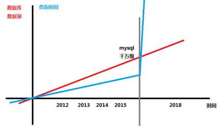
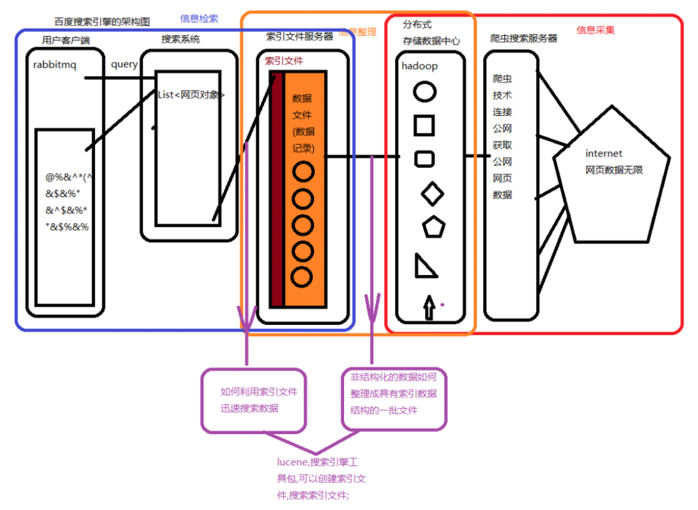
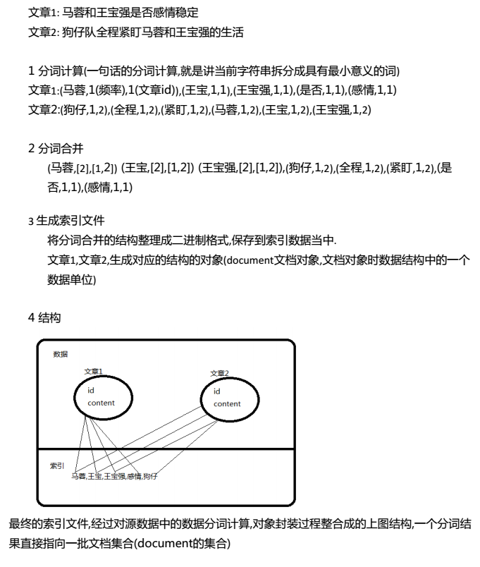

# Lucene

## 信息检索概述

### 信息过载

* YouTube一分钟上传400小时视频
* Apple用户一分钟下载51000个app
* Google一分钟翻译69500000个单词
* siri一分钟回答错误90000个问题

信息越来越多，提高检索效率和生成新的检索技术是关键。

## 传统检索方式

### 操作系统文件检索

* 直接通过操作系统搜索磁盘，全表遍历
    * 缺点：慢

### 数据库检索

* like模糊查询：可以完成目前大部分检索的需要`%关键字%`
* 索引优化
    * 表格有数据量上限



* 查询效率在临界点时，查询时间无限增加
    * 缺点：数据量受限制
    
## 信息检索系统

### 信息检索系统的组成

1. 信息采集
   搜索引擎，通过网络爬虫技术，将公网的各个服务器的数据按照一定的规则，从万维网获取数据，单位超过亿级别，数据庞大。
2. 信息整理
   爬取的这些内容，非结构化数据，无法完成任何快速搜索技术的搭建，一定经过处理，整理成有一定数据结构的数据文件才可以进行搜索的服务提供（创建索引的过程）。
3. 接收查询
   用户向检索系统发出查询请求，信息检索系统接收这个参数，在数据中获取对应的结构，返回用户。



### 全文检索的倒排索引计算方式（网页）

* 数据源：数据库，公共网页，各种行业中的数据，不同位置，不同系统，不同软件存储
* 倒排索引：构成全文检索技术的创建索引文件的核心计算方法
* 网页数据（源数据）



## Lucene简介

> 基于java编写的搜索引擎的工具包，特点是稳定，索引性能高（倒排索引）。

* 增量索引和批量索引一样快
* 提供排名
* 支持多种主流的搜索功能
    * 短语
    * 通配符
    * 模糊
    * 近似
    * 范围
    * 此项
    * 多义词

## Lucene的分词计算

> 分词的过程就是将源数据中某段字符串根据人类使用语言的习惯进行词汇的切分。

```java
public class LuceneTest {
    public static void printAnalyzer(Analyzer analyzer, String str) throws Exception {
        StringReader reader = new StringReader(str);
        TokenStream tokenStream = analyzer.tokenStream("test", reader);
        tokenStream.reset();
        CharTermAttribute attribute = tokenStream.getAttribute(CharTermAttribute.class);
        while (tokenStream.incrementToken())
            System.out.println(attribute.toString());
    }
    
    @Test
    public void run() throws Exception {
        Analyzer a1 = new SmartChineseAnalyzer();
        Analyzer a2 = new WhiteSpaceAnalyzer();
        Analyzer a3 = new SimpleAnalyzer();
        String str = "test";
        System.out.println("智能分词器***");
        LucenTokenTest.printAnalyzer(a1, str);
        System.out.println("空格分词器***");
        LucenTokenTest.printAnalyzer(a2, str);
        System.out.println("简单分词器***");
        LucenTokenTest.printAnalyzer(a3, str);
    }
}
```

## IK分词器

> 常见的一种中文分词器，可以智能分析中文词汇，可以做到扩展词汇。

### 使用ik分词器

1. 添加依赖

    ```xml
    <dependencises>
        <dependency> <!-- 查询相关jar包 -->
            <groupId>org.apache.lucene</groupId>
            <artifactId>lucene-queryparser</artifactId>
            <version>6.0.0</version>
        </dependency>
        <dependency> <!-- lucene自带只能中文分词器jar包 -->
            <groupId>org.apache.lucene</groupId>
            <artifactId>lucene-analyzers-smartcn</artifactId>
            <version>6.0.0</version>
        </dependency>
        <dependency> <!-- 测试用到的lucene工具包 -->
            <groupId>org.apache.lucene</groupId>
            <artifactId>lucene-analyzers-common</artifactId>
            <version>6.0.0</version>
        </dependency>
        <dependency> <!-- 测试用到的lucene核心包 -->
            <groupId>org.apache.lucene</groupId>
            <artifactId>lucene-core</artifactId>
            <version>6.0.0</version>
        </dependency>
    </dependencises>
    ```

2. 4.0版本后，为了实现解耦和自定义流属性，需要自行完成`analyzer`、`tokenizer`等代码

    ```java
    package com.jt.lucene.IK;
    
    import org.apache.lucene.analysis.Analyzer;
    import org.apache.lucene.analysis.Tokenizer;
    
    public class IKAnalyzer6x extends Analyzer{
        private boolean useSmart;
        public boolean useSmart(){
            return useSmart;
        }
        public void setUseSmart(boolean useSmart){
            this.useSmart = useSmart;
        }
        public IKAnalyzer6x(){
            this(false);//IK分词器lucene analyzer接口实现类，默认细粒度切分算法
        }
        //重写最新版本createComponents；重载analyzer接口，构造分词组件
        @Override
        protected TokenStreamComponents createComponents(String filedName) {
            Tokenizer _IKTokenizer = new IKTokenizer6x(this.useSmart);
            return new TokenStreamComponents(_IKTokenizer);
        }
        public IKAnalyzer6x(boolean useSmart){
            super();
            this.useSmart = useSmart;
        }
        
    }
    ```
    
    ```java
    package com.jt.lucene.IK;
    
    import java.io.IOException;
    
    import org.apache.lucene.analysis.Tokenizer;
    import org.apache.lucene.analysis.tokenattributes.CharTermAttribute;
    import org.apache.lucene.analysis.tokenattributes.OffsetAttribute;
    import org.apache.lucene.analysis.tokenattributes.TypeAttribute;
    import org.wltea.analyzer.core.IKSegmenter;
    import org.wltea.analyzer.core.Lexeme;
    
    public class IKTokenizer6x extends Tokenizer{
        //ik分词器实现
        private IKSegmenter _IKImplement;
        //词元文本属性
        private final CharTermAttribute termAtt;
        //词元位移属性
        private final OffsetAttribute offsetAtt;
        //词元分类属性
        private final TypeAttribute typeAtt;
        //记录最后一个词元的结束位置
        private int endPosition;
        //构造函数，实现最新的Tokenizer
        public IKTokenizer6x(boolean useSmart){
            super();
            offsetAtt = addAttribute(OffsetAttribute.class);
            termAtt = addAttribute(CharTermAttribute.class);
            typeAtt = addAttribute(TypeAttribute.class);
            _IKImplement = new IKSegmenter(input, useSmart);
        }
    
        @Override
        public final boolean incrementToken() throws IOException {
            //清除所有的词元属性
            clearAttributes();
            Lexeme nextLexeme = _IKImplement.next();
            if(nextLexeme != null){
                //将lexeme转成attributes
                termAtt.append(nextLexeme.getLexemeText());
                termAtt.setLength(nextLexeme.getLength());
                offsetAtt.setOffset(nextLexeme.getBeginPosition(), 
                        nextLexeme.getEndPosition());
                //记录分词的最后位置
                endPosition = nextLexeme.getEndPosition();
                typeAtt.setType(nextLexeme.getLexemeText());
                return true;//告知还有下个词元
            }
            return false;//告知词元输出完毕
        }
        
        @Override
        public void reset() throws IOException {
            super.reset();
            _IKImplement.reset(input);
        }
        
        @Override
        public final void end(){
            int finalOffset = correctOffset(this.endPosition);
            offsetAtt.setOffset(finalOffset, finalOffset);
        }
    
    }
    ```

3. 测试使用

### ik分词器的扩展词典和停用词典设置

* 配置文件`IKAnalyzer.cfg.xml`

    ```xml
    <properties>
        <comment>IK Analyzer 扩展配置</comment>
        <!--自定义扩展字典
        <entry key="ext_dict">ext.dic;</entry>
        -->
        <!--自定义扩展停止词字典-->
        <entry key="ext_stopwords">stopword.dic;</entry>
    </properties>
    ```

* `ext.dic`扩展词典和`stopwords.dic`停用词典必须在同一个文件夹下
    * 当前工程的加载文件默认相对路径
    * maven工程中，添加到`target/classes`
* 扩展词典停用词典的编码格式要与字符串的编码格式一致
* 一定要被工程加载

## Lucene创建索引

> 创建索引是根据数据源读取的数据，进行整理，完成倒排索引后输出成索引文件。

### 索引概念

* 文档：检索结果的对象封装（数据单位），可以封装一个网页内容，也可以封装一条商品的数据记录
* 查询：搜索条件的封装，在查询时有各种条件限制可以在查询对象中体现，最终实现利用查询对象完成复杂的搜索逻辑
* 词项：分词计算结果的最小意义的词
* 域：文档对象的一个属性，根据封装的内容不同，域可以变动

```java
public class IKTest {
    @Test
    public void createIndex() throws Exception{
        Path path = Paths.get("index");
        FSDirectory directory = FSDirectory.open(path);
        Analyzer analyzer = new IKAnalyzer6x();
        IndexWriterConfig config = new IndexWriterConfig(analyzer);
        config.setOpenMode(OpenMode.CREATE);
        Document doc1 = new Document();
        Document doc2 = new Document();
        doc1.add(new StringField("id", "1000", Store.YES));
        doc1.add(new TextField("title", "三星", Store.YES));
        doc2.add(new StringField("id", "100", Store.NO));
        doc2.add(new StringField("content", "test", Store.NO));
        IndexWriter writer = new IndexWriter(directory, config);
        writer.addDocument(doc1);
        writer.addDocument(doc2);
        writer.commit();
        writer.close();
        directory.close();
    }
}
```

* 新创建的索引文件，数据结构无法使用普通的软件查看，需要利用专门的工具
* LUKE工具6.0.0必须和Lucene的代码版本完全一致
* StringField和TextField的区别
    * StringField不做分词计算，TextField会做分词计算
* Store.YES和Store.NO的区别
    * Store.YES在document的索引数据对象中保存数据，Store.NO不保存
    * 搜索时，搜索到的一批document结果集，如果域yes保存，可以从结果集的对象中获取域的数据
        * no不保存，即使搜到这个document也无法获取域的值
        
## Lucene索引的查询

> Query是一个查询条件的接口类，不同的查询结构，可以利用不同的实现类来完成条件的封装

```java
public class IKSearch {
    // 查询入门
    
    /**
    * 可以根据分词计算结果的词项
    * 把收集的查询条件做成TermQuery
    * 如果有词项并对应指向了一批document将会把查询结果返回
    * 拿到的数据结果就是documents（文档对象的集合）
    * 
    * @throws Exception Exception
    */
    @Test
    public void search() throws Exception{
        Path path = Paths.get("index");
        FSDirectory directory = FSDirectory.open(path);
        IndexReader reader = new DirectoryReader.open(directory);
        IndexSearcher searcher = new IndexSearcher(reader);
        Analyzer analyzer = new IKAnalyzer6x();
        QueryParser parser = new QueryParser("title", analyzer);
        parser.setDefaultOperator(Operator.OR);
        Query query = parser.parse("三星英特尔");
        TopDocs docs = searcher.search(query, 10);
        ScoreDoc[] scoreDocs = docs.scoreDocs;
        for (ScoreDoc scoreDoc : scoreDocs) {
            Document doc = searcher.doc(scoreDoc.doc);
            System.out.println("id:" + doc.get("id"));
            System.out.println("title:" + doc.get("title"));
            System.out.println("desc:" + doc.get("desc"));
            System.out.println("文档评分：" + scoreDoc.score);
        }
    }
    
    // 多域查询
    
    /**
    * 利用多个域的名称和数据，封装MutiFieldQuery对象
    * 利用这个查询对象进行数据搜索
    * 
    * @throws Exception Exception
    */
    @Test
    public void searchMuti() throws Exception{
        Path path = Paths.get("index");
        FSDirectory directory = FSDirectory.open(path);
        IndexReader reader = new DirectoryReader.open(directory);
        IndexSearcher searcher = new IndexSearcher(reader);
        Analyzer analyzer = new IKAnalyzer6x();
        String[] fields = {"title", "content"};
        MultiFieldQueryParser parser = new MultiFieldQueryPaser(fields, analyzer);
        Query query = parser.parse("三星");
        TopDocs docs = searcher.search(query, 10);
        ScoreDoc[] scoreDocs = docs.scoreDocs;
        for (ScoreDoc scoreDoc : scoreDocs) {
            Document doc = searcher.doc(scoreDoc.doc);
            System.out.println("id:" + doc.get("id"));
            System.out.println("title:" + doc.get("title"));
            System.out.println("desc:" + doc.get("desc"));
            System.out.println("content:" + doc.get("content"));
            System.out.println("webid:" + doc.get("webid"));
            System.out.println("文档评分：" + scoreDoc.score);
        }
    }
    
    // 词项查询
    
    /**
    * 直接对比词项不可进行二次的分词计算
    * 
    * @throws Exception Exception
    */ 
    @Test
    public void SearchTerm() throws Exception{
        Path path = Paths.get("index");
        FSDirectory directory = FSDirectory.open(path);
        IndexReader reader = new DirectoryReader.open(directory);
        IndexSearcher searcher = new IndexSearcher(reader);
        Analyzer analyzer = new IKAnalyzer6x();
        Term term = new Term("title", "三星英特尔");
        Query query = new TermQuery(term);
        TopDocs docs = searcher.search(query, 10);
        ScoreDoc[] scoreDocs = docs.scoreDocs;
        for (ScoreDoc scoreDoc : scoreDocs) {
            Document doc = searcher.doc(scoreDoc.doc);
            System.out.println("id:" + doc.get("id"));
            System.out.println("title:" + doc.get("title"));
            System.out.println("desc:" + doc.get("desc"));
            System.out.println("content:" + doc.get("content"));
            System.out.println("webid:" + doc.get("webid"));
            System.out.println("文档评分：" + scoreDoc.score);
        }
    }
    
    // 布尔查询
    
    /**
    * 组合多种query的查询方式
    * 并且在言明中间结果的逻辑关系
    * 
    * @throws Exception Exception
    */
    @Test
    public void searchBoolean() throws Exception{
        Path path = Paths.get("index");
        FSDirectory directory = FSDirectory.open(path);
        IndexReader reader = new DirectoryReader.open(directory);
        IndexSearcher searcher = new IndexSearcher(reader);
        Analyzer analyzer = new IKAnalyzer6x();
        Term term01 = new Term("title", "三星");
        Query query01 = new TermQuery(term); 
        Term term02 = new Term("title", "英特尔");
        Query query02 = new TermQuery(term);
        BooleanClause bc1 = new BooleanClause(query01, Occur.MUST);
        BooleanClause bc2 = new BooleanClause(query02, Occur.MUST_NOT);
        BooleanQuery query = new BooleanQuery.Builder().add(bc1).add(bc2).build();
        TopDocs docs = searcher.search(query, 10);
        ScoreDoc[] scoreDocs = docs.scoreDocs;
        for (ScoreDoc scoreDoc : scoreDocs) {
            Document doc = searcher.doc(scoreDoc.doc);
            System.out.println("id:" + doc.get("id"));
            System.out.println("title:" + doc.get("title"));
            System.out.println("desc:" + doc.get("desc"));
            System.out.println("content:" + doc.get("content"));
            System.out.println("webid:" + doc.get("webid"));
            System.out.println("文档评分：" + scoreDoc.score);
        }
    }
    
    // 范围查询
    @Test
    public void searchRange() throws Exception{
        Path path = Paths.get("index");
        FSDirectory directory = FSDirectory.open(path);
        IndexReader reader = new DirectoryReader.open(directory);
        IndexSearcher searcher = new IndexSearcher(reader);
        Analyzer analyzer = new IKAnalyzer6x();
        Query query = IntPoint.newRangeQuery("price", 4500, 6000);
        ScoreDoc[] scoreDocs = docs.scoreDocs;
        for (ScoreDoc scoreDoc : scoreDocs) {
            Document doc = searcher.doc(scoreDoc.doc);
            System.out.println("id:" + doc.get("id"));
            System.out.println("title:" + doc.get("title"));
            System.out.println("desc:" + doc.get("desc"));
            System.out.println("content:" + doc.get("content"));
            System.out.println("webid:" + doc.get("webid"));
            System.out.println("文档评分：" + scoreDoc.score);
        }
    }
    
    // 前缀查询
    
    /*
        PrefixQuery前缀查询条件
        需要先定义一个词项Term
        表示当文档中的词项以这个term内容开始时
        返回查询数据
        Term term = new Term("title", "微型");
        Query query = new PrefixQuery(term);
        查到所有用“微型”起始的内容
        返回document结果集
     */
    
    // 多关键字查询
    
    /*
        除了TermQuery外还有多个词项关键字查询的条件
        PhraseQuery.Builder build = new PhraseQuery.Builder();
        build.add(new Term("title", "黑色"));
        build.add(new Term("title", "英特尔"));
        PhraseQuery query = build.build();
     */
    
    // 模糊查询
    
    /*
        FuzzyQuery，可以识别简单的相近字
        已经完成的底层算法
        对不同的语言支持能力有待验证
        Term term = new Term("name", "tramp");
        FuzzyQuery query = new FuzzyQuery(term);
     */
    
    // 通配符
    
    /*
        WildcardQuery query = new WildcardQuery(new Term("name", "不？"));
        词项中不是，不能，不要，不可以（?匹配一个还是所有）
     */
}
```

## Lucene缺点

### 不支持分布式

* 只是底层代码实现的索引使用的逻辑，并不能完成海量数据整理成索引后，对索引文件的分布式高可用管理。
* 在搜索系统中，保证系统逻辑的高可用是容易做到的，但在数据层面，Lucene无法完成分布式的输入和输出。
