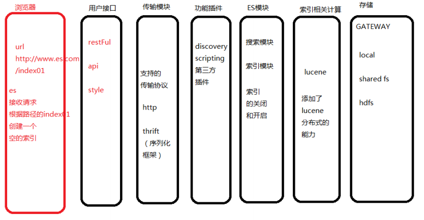

# ElasticSearch

> 基于Lucene的搜索服务，java编写，底层封账了Lucene的搜索功能，支持分布式的对index索引的操作缺点。

## ElasticSearch结构



* gatway：es的索引文件的存储
    * 本地
    * 共享
    * HDFS
* Lucene分布式框架：es基于Lucene实现的分布式模块
* es功能模块：es自己的功能
    * 关闭、开启索引（应用级别的开启和关闭）
* 插件：discovery发现插件
    * scripting，可以支持多种语言来对接操作es
* 传输模块：支持与es数据交互的底层协议
* 用户接口：RestFUl传参

## 安装es

1. wget获取安装包
    
    ```bash
    wget "http://bj-yzjd.ufile.cn-north-02.ucloud.cn/elasticsearch-5.5.2.tar.gz"
    ```

2. `tar`命令解压安装包

    ```bash
    tar -xf elasticsearch-5.5.2.tar.gz
    ```

3. 添加当前主机的普通用户

    ```bash
    groupadd elasticsearch
    useradd es -g elasticsearch -p es
    ```
    
    * root作为最高权限的管理员用户，es启动时不允许使用root用户
    * 创建普通账户es，登录密码es来管理elasticsearch的启动和调用

4. 修改新用户的操作权限

    ```bash
    chown -R es /home/software/elasticsearch-5.5.2
    ```

5. 修改es启动占用的内存空间

    * 默认情况下，es启动占用2G内存，对云主机内存不足的情况有所限制，修改至512M足够
    
    ```bash
    # 修改es根目录下config目录的jvm.options
    # vim jvm.options
    
    # p23
    # before
    -XMs2g
    -Xmx2g
    # after
    -XMs512m
    -Xmx512m
    ```

6. 启动es测试

    ```bash
    elasticsearch
    ```
    
    * 在es的根目录的bin目录下执行启动文件命令`elasticsearch`
    * es启动后，提供9200端口进行HTTP协议的访问，可以调用`curl`命令测试es程序
    
    ```bash
    curl localhost:9200
    ```
    
7. 后台启动

    ```bash
    elasticsearch -d
    ```

## es配置

### 配置elasticsearch.yml

> elasticsearch加载使用es根目录下的config目录中的elasticsearch.yml文件

```bash
# p17 cluster.name  自定义集群名称
# es的discovery模块会自动发现在同一个网络通信区间下的es节点，如果有多个集群，使用集群名称加以区分

# p23 node.name 自定义节点名称

# p33 path.data 索引数据存储位置（保持默认，不需要开启注释）
# 默认使用es根目录下的data文件夹，可以设置多个存储路径，使用 "," 隔开
# 例如：path.data:/path01,/path02
# 如果开启，必须是es用户的管理路径权限

# p37 path.logs 日志路径（保持默认）

# p55 network.host  当前es节点绑定的ip地址
# 默认127.0.0.1，如果对外开放端口，需要修改属性，可以绑定本机对外访问ip

# p59 http.port 启动的es对外访问的HTTP端口，默认9200
```

## HEAD插件安装

> 是一个HTML5编写的集群操作和管理工具。Head插件中可以显示集群的拓扑结构，执行索引和节点级别等操作，可以输入RestFul命令和ElasticSearch交互。

1. 配置node环境

    ```bash
    tar -xf node-v6.11.4-linux-x64.tar.xz
    # 根目录下的bin目录
    npm install -g grunt-cli
    ```

2. 安装head插件

    ```bash
    yum -y install unzip zip
    unzip elasticSearch-head-master.zip
    ```

3. 修改elasticSearch.yml

    ```yaml
    http.cors.enable: true
    http.cors.allow-origin: "*"
    ```

4. 修改head插件配置文件Guntfile.js

    ``` js
    connect: {
        server: {
            options: {
                hostname: '10.9.30.13',
                port: 9100,
                base: '.',
                keepalive: true
            }
        }
    }
    ```
    
5. 配置node的环境变量

    ```bash
    vim /etc/profile
    
    NODE_HOME=/home/software/node6
    PATH=$PATH:./:$NODE_HOME/bin
    export PATH NODE_HOME
    
    source /etc/profile
    ```

6. 启动head插件访问

    ```bash
    gruant server
    ```
    
## es的使用操作

### es操作的概念

* 索引index：es中的索引文件，经过底层Lucene的创建，形成的一个具有分布式结构的文件夹
* 类型type：在一个索引中，可以根据业务定义的多种结构，一个类型相当于当前所有的一部分document的固定结构
* 文档document：数据的基本单位
* 域field：每个文档对象中的各种属性

### 操作es的概念

* 数据库中操作语言：SQL
* es的索引操作规格：DSL
* 新增
    * SQL：`insert into`
    * DSL：`PUT http://`
* 查询
    * SQL：`select`
    * DSL：`GET http://`
* 更新
    * SQL：`update`
    * DSL：`POST http://`
* 删除
    * SQL：`delete from`
    * DSL：`DELETE http://`

### 索引的管理

1. 新建索引

    ```bash
    curl -XPUT http://10.9.39.13:9200/{端口名称}{"acknowledged":true,"shards_acknowledged":true}
    ```

2. 设置索引的读写权限

    ```bash
    curl -XPUT -d '{"blocks.read":false}'http://10.9.39.13:9300/{索引名称}/_settings
    ```

3. 索引的打开和关闭
    
    ```bash
    curl -XPOST http://10.9.39.13:9200/{索引名称}/_close
    cur - XPOST http://10.9.39.13.9200/{索引名称}/-open
    ```
    
4. 删除

    ```bash
    curl -X -XDELETE HTTP://10.9.39.13:9200/{索引名称}
    ```

### 文档管理

1. 新建文档，通过DSL传递文档的数据，json字符串，规定属性名称和值

    ```js 
    id,title,content
    {
        "id":1
        "title":"es简介"
        "content":"test"    
    }
    ```

    ```bash
    curl -XPUT -d '{"id":1,"title":"es简介","content":"test"}' http://106.75.120.140:9200/{索引名称}/{类型名称}/{文档id}
    ```

2. 获取文档

    ```bash
    curl -XGET http://10.9.100.26:9200/index01/article/1
    ```

3. 获取多个文档

    ```bash
    curl -XGET  -d '{"docs":[{"_index":"index01","_type":"article","_id":"1"},{"_index":"index01","_type":"article","_id":"2"}]}' http://10.9.100.26:9200/_mget
    ```
    
4. 删除文档

    ```bash
    curl -XDELETE http://10.9.100.26:9200/index01/article/1
    ```

### 搜索数据

创建索引时，依然是倒排索引的计算，将文档的数据内容进行分词计算，获取文档中所有的分词，最终形成词项关联到文档的索引结构

1. `match_all`查询一个索引的所有文档

    ```bash
    curl -XGET http://10.9.100.26:9200/index01/_search -d '{"query": {"match_all": {}}}'
    ```

2. `term query`词项查询

    ```bash
    curl -XGET http://10.9.100.26:9200/index01/_search -d '{"query":{"term":{"title":"java"}}}'
    ```
    
3. `match query`

    ```bash
    curl -XGET http://10.9.100.26:9200/index01/_search -d '{"query":{"match":{"title":"java编程思想"}}}'
    ```
    
## javaAPI操作ElasticSearch

### 添加依赖

```xml
<dependencies>
    <dependency>
        <groupId>org.elasticsearch.client</groupId>
        <artifactId>transport</artifactId>
        <version>5.5.2</version>
    </dependency>
</dependencies>
```

### 搜索的应用

```java
package com.jt.es.test;

import java.net.InetAddress;
import java.net.UnknownHostException;

import org.elasticsearch.action.admin.indices.exists.indices.IndicesExistsResponse;
import org.elasticsearch.action.get.GetResponse;
import org.elasticsearch.action.search.SearchResponse;
import org.elasticsearch.client.IndicesAdminClient;
import org.elasticsearch.client.transport.TransportClient;
import org.elasticsearch.common.settings.Settings;
import org.elasticsearch.common.transport.InetSocketTransportAddress;
import org.elasticsearch.index.query.MatchQueryBuilder;
import org.elasticsearch.index.query.Operator;
import org.elasticsearch.index.query.QueryBuilders;
import org.elasticsearch.search.SearchHit;
import org.elasticsearch.search.SearchHits;
import org.elasticsearch.transport.client.PreBuiltTransportClient;
import org.junit.Before;
import org.junit.Test;

import com.fasterxml.jackson.databind.ObjectMapper;

public class ESTest {
	private TransportClient client;
	
	//连接es测试
	@Test
	public void test01() throws Exception{
		//Settings.EMPTY是一个setting对象,保持默认配置,
		//例如 配置集群名称 默认elasticsearch
		TransportClient client =
				new PreBuiltTransportClient(Settings.EMPTY);
		//添加连接的节点,内部管理连接池.
		client.addTransportAddress(
				new InetSocketTransportAddress(
					InetAddress.getByName("10.9.100.26"),9300));
		//如果需要连接集群操作,只需要传递所有的master节点信息
		//获取某个文档
		GetResponse response = client.prepareGet("index01", 
				"article", "1").get();
		//response获取返回的字符串
		String result = response.getSourceAsString();
		System.out.println(result);
	
	}
	
	//索引的操作
	//判断索引是否存在
	@Test
	public void test02() throws UnknownHostException{
		//从连接对象获取一个索引的管理者;
		IndicesAdminClient indices = client.admin().indices();
		//调用存在方法
		IndicesExistsResponse response = indices.prepareExists("index02").get();
		System.out.println("当前索引存在的结果是:"+response.isExists());
	
	}
	
	//创建索引
	@Test
	public void test03() throws UnknownHostException{
		IndicesAdminClient indices = client.admin().indices();
		indices.prepareCreate("index03").get();
	}
	
	//操作文档
	//新建文档
	/*
	 * 如何将代码的数据,转化成es需要的数据结构 json
	 */
	@Test
	public void test04()throws Exception{
		//准备文档数据的对象
		Book book=new Book();
		book.setId(1);
		book.setBookName("小王子");
		book.setContent("王子最后死了");
		//jackson中的mapper对象进行数据的转化
		ObjectMapper mapper=new ObjectMapper();
		String json= mapper.writeValueAsString(book);
		System.out.println(json);
		client.prepareIndex("index01","article","10").
		setSource(json).execute().actionGet();
	}
	
	@Before
	public void getSource() throws UnknownHostException{
		//例如 配置集群名称 默认elasticsearch
		client =
				new PreBuiltTransportClient(Settings.EMPTY);
		//添加连接的节点,内部管理连接池.
		client.addTransportAddress(
				new InetSocketTransportAddress(
					InetAddress.getByName("10.9.100.26"),9300));
	}
	
	//搜索功能/功能非常丰富,lucene的方法这里都有
	@Test
	public void test06(){
		//构建一个查询条件 matchQuery
		MatchQueryBuilder query = QueryBuilders.matchQuery("title", "java编程思想").
		operator(Operator.AND);//必须包含全部的分词结果才能匹配
		//调用连接对象获取查询结果
		//setFrom 和setSize两个方法的调用,可以查询分页内容
		//第一页内容,20条数据 from(0).size(20) page rows/size
		//第二页内容,from(20).size(20),from((page-1)*rows).size(rows)
		SearchResponse response = client.prepareSearch("index01").
		setQuery(query).setFrom(0).setSize(20).get();
		SearchHits hits = response.getHits();
		System.out.println("总共获取:"+hits.totalHits);
		for (SearchHit hit : hits) {
			//打印属性
			System.out.println("id:"+hit.getSource().get("id"));
			System.out.println("title:"+hit.getSource().get("title"));
			System.out.println("content:"+hit.getSource().get("content"));
		}
	}
}
```

## mapping和ik分词器

### mapping

es在创建数据时，提供设定document中字段类型，分词指定的逻辑，这种关系的设定叫做mapping格式。

### ik分词器在es中的使用

1. 获取安装的ik分词器包，`elasticsearch-analysis-ik`
2. 将安装包解压，es根目录的plugins中，安装包如果在plugins里需要删除，将解压的文件夹改名为analysis-ik/ik
3. 在ik分词器目录下的config中配置3个文件
    * xml配置文件
    * ext扩展词典
    * stopword停用词典
4. 测试ik分词器是否启动
5. 利用mapping完成对象document的创建时的字段属性设定和分词器的使用
    
    ```java
    public class IKTest {
        @Test
        public void test07() throws Exception {
            String indexName = "index05";
            String typeName = "school";
            TransportClient client = new PreBuiltTransportClient(Settings.EMPTY);
            client.addTransportAddress(new InetSocketTransportAddress(InetAddress.getByName("106.75.120.140"), 9300));
            client.admin().indices().prepareCreate(indexName).execute().get();
            XContentBuilder builder = XContentFactory.jsonBuilder()
                                    .startObject().startObject("properties")
                                    .startObject("id").field("type", "integer")
                                    .field("store", "yes").endObject()
                                    .startObject("name").field("type", "string")
                                    .field("store", "yes").field("analyzer", "ik_max_word")
                                    .field("search_analyzer", "ik_max_word").endObject()
                                    .endObject().endObject();
            PutMappingRequest mappingBind = Requests.putMappingRequest(indexName).type(typeName).source(builder);
            client.admin().indices().putMapping(mappingBind).actionGet();
        }
    }
    ```

6. 测试mapping是否设置成功

```bash
curl -XPUT -d '{"id":"1","name":"test"}' http://10.9.104.184:9200/index05/school/1
```
